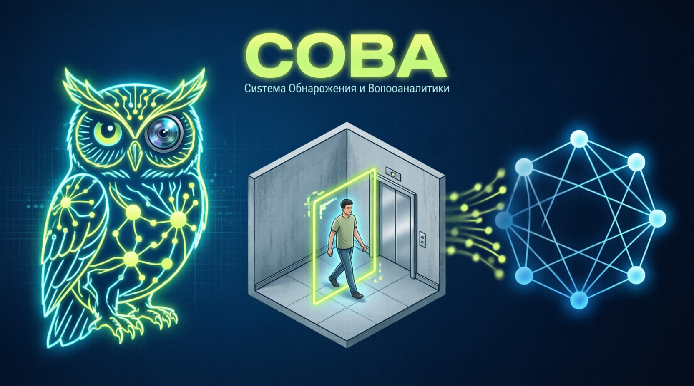

<div align="center">



# СОВА

**Система Обнаружения и Видеоаналитики жилой среды**

Событийное видеонаблюдение без архива 24/7: детекция и трекинг людей,
классификация событий, Telegram-уведомления, архив с pre-roll буфером
и ML-контур с версионированием и дообучением моделей.


</div>

---

## 🦉 Что это

СОВА — self-hosted платформа событийной видеоаналитики для жилой среды.
Вместо круглосуточной записи система держит короткий кольцевой буфер
и сохраняет **только значимые события**: появился человек, задержался
у лифта, вошёл в зону, оставил предмет.

Концепция масштабирования: **узел СОВА** (этаж) → **кластер** (дом) →
**сеть** (район). MVP работает на одном узле, но архитектура готова к росту.

> 🔐 Privacy by design: без аудио, без распознавания лиц, privacy-маски
> на частных зонах, локальное хранение, письменное согласие всех
> собственников квартир.

## ✨ Ключевые возможности

- 📹 **RTSP-ингест** — основной и субпоток, автовосстановление
- 🔁 **Кольцевой буфер** — событие не теряет начало (pre/post-roll)
- 🧍 **Детекция и трекинг** — YOLO + ByteTrack
- 🧠 **Классификация событий** — loitering, несколько человек, зоны
- 🔔 **Уведомления** — Telegram / email / webhook с анти-спамом
- 🗂️ **Архив событий** — клипы, snapshots, метаданные, SHA-256
- 🖥️ **Веб-интерфейс** — live, таймлайн, разметка, управление моделями
- 🧬 **Model registry** — загрузка весов, метрики, shadow mode, откат
- 🔐 **RBAC + аудит** — каждый просмотр и экспорт журналируется

## 🏗️ Архитектура

```
IP-камера (RTSP / PoE)
        │
        ▼
 Ингест (go2rtc / FFmpeg) ── кольцевой буфер
        │
        ▼
 Детекция (YOLO) ── Трекинг (ByteTrack)
        │
        ▼
 Зонная логика ── кандидат в событие
        │
        ▼
 Классификатор / ансамбль ── Event manager
        │
   ┌────┼────────────┐
   ▼    ▼            ▼
  БД   Медиahранилище  Уведомления
        │
        ▼
   Веб-интерфейс / REST API
```

## 🛠️ Стек

| Слой | Технологии |
|---|---|
| Ингест | go2rtc, FFmpeg |
| CV | YOLOv8/v11, ByteTrack, ONNX Runtime / OpenVINO |
| Backend | Python 3.12, FastAPI, SQLAlchemy |
| Данные | PostgreSQL, Redis, MinIO / FS |
| Frontend | React (в планах) |
| Инфраструктура | Docker Compose, Caddy, WireGuard |

## 🚀 Быстрый старт

```bash
# 1. Настроить камеру
cp deploy/config.example.yml deploy/config.yml

# 2. Поднять стек
docker compose up -d

# 3. Открыть интерфейс
open http://localhost:8000
```

## 📁 Структура репозитория

```
├── assets/     # баннер, скриншоты
├── docs/       # TZ.md, architecture.md
├── deploy/     # docker-compose, конфиги
├── backend/    # событийная платформа (FastAPI)
├── cv/         # детекция / трекинг / классификация / обучение
├── frontend/   # веб-интерфейс
└── scripts/    # экспорт датасета, eval, обслуживание
```

## 🗺️ Roadmap

- [x] Концепция и ТЗ v1.0
- [ ] Этап 0 — камера + базовая детекция
- [ ] Этап 1 — событийный сервис, архив, алерты, интерфейс
- [ ] Этап 2 — трекинг + классификация событий
- [ ] Этап 3 — model registry, shadow mode, откат
- [ ] Этап 4 — цикл разметки и дообучения

## 🏙️ Масштабирование

| Уровень | Объект | Контур |
|---|---|---|
| Узел | этаж | edge-обработка, локальные события |
| Кластер | дом | агрегация событий, общий registry |
| Сеть | район | метаданные, федеративное обучение |

## 🔐 Закон и приватность

Установлено с письменного согласия всех собственников квартир, таблички
размещены, управляющая компания извещена. Записи хранятся локально,
доступ — по ролям, срок хранения ограничен.

## 📄 Лицензия

MIT
